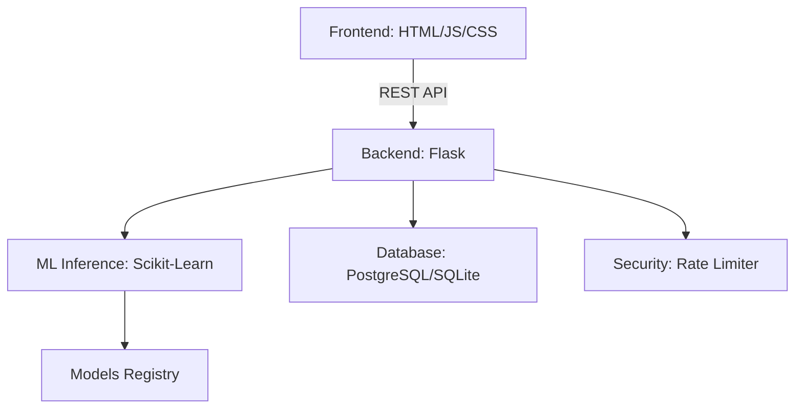

# Smart Health Sync

**AI-Powered Clinical Diagnostic Platform**

> A production-grade, portfolio-quality healthcare AI system using ensemble machine learning to detect six chronic conditions from 24 standardised blood biomarkers — achieving **95.1% accuracy** with a Random Forest classifier.

---

## Overview

Smart Health Sync is a final-year Computer Science research project at the **University of Ghana** (2026). It is designed as a scalable, enterprise-quality proof-of-concept demonstrating how supervised machine learning can augment clinical decision support in resource-constrained healthcare environments.

### Detectable Conditions

| Condition | Key Biomarkers | F1-Score |
|---|---|---|
| Healthy Reference | Baseline values | 0.985 |
| Type 2 Diabetes | HbA1c, Glucose | 0.942 |
| Clinical Anemia | Hemoglobin, RBC | 0.958 |
| Ischemic Heart Disease | Troponin, Lipids | 0.931 |
| Thalassemia | MCV, MCH | 0.967 |
| Thrombocytopenia | Platelets | 0.948 |

---

## Architecture



### Project Structure
```
smarthealth/
├── backend/
│   ├── api/                # Blueprints for Routes & Views
│   ├── database/           # SQLAlchemy Models & Migrations
│   ├── ml/                 # Training, Inference, & Registry
│   ├── middleware/         # Security & Custom Logic
│   ├── config.py           # Multi-env Config
│   └── factory.py          # App Factory Init
├── frontend/
│   ├── static/             # Assets (CSS/JS/Images)
│   └── templates/          # Jinja2 HTML Templates
├── models/                 # Model Registry (Sync with Backend)
├── datasets/               # Clinical Data (CSV)
├── docker/                 # Production Dockerisation
├── .github/                # CI/CD Workflows
├── main.py                 # Production Entry
└── README.md
```

---

## Database Schema (SQLAlchemy)

The system implements a production-grade relational schema for clinical data management:

- **Users**: Authentication and RBAC (Admin/Provider roles).
- **Patients**: Encrypted patient metadata and clinical history.
- **DiagnosticRecords**: Immutable logs of AI predictions with biomarker snapshots.
- **ModelAuditLogs**: Traceability for model usage and performance drift.

---

## Security & Reliability

- **Rate Limiting**: Integrated `Flask-Limiter` with Redis/Memory support (200/day, 10/min).
- **Environment Isolation**: Secure config management via `pathlib` and environment variables.
- **Model Fallback**: Cascade system ensures diagnostic availability even if primary models are corrupt.
- **CORS**: Strict origin-based access control.

---

## ML Models

| Model | Test Accuracy | CV Mean | Status |
|---|---|---|---|
| **Random Forest** ⭐ | **95.1%** | 94.1% | Production |
| SVM (RBF Kernel) | 94.9% | 93.8% | Valid |
| Decision Tree | 92.6% | 91.7% | Valid |
| Logistic Regression | 81.9% | 82.2% | Baseline |

Training details:
- **24 biomarkers** (metabolic, cardiovascular, hematological, hepatic/renal)
- **3,700+ training samples** balanced with **SMOTE**
- **Stratified 5-Fold Cross-Validation**
- **StandardScaler** preprocessing

---

## API Endpoints

| Endpoint | Method | Description |
|---|---|---|
| `/api/health` | GET | System health check |
| `/api/health/models` | GET | ML model validation status |
| `/api/predict` | POST | Clinical diagnostic inference |
| `/api/models` | GET | Available classifiers & features |
| `/api/metadata` | GET | API metadata |

### Example: `/api/predict`

**Request:**
```json
POST /api/predict
{
  "features": {
    "Glucose": 0.85,
    "HbA1c": 0.78,
    "Hemoglobin": 0.55,
    "Platelets": 0.62,
    "...": "... (24 biomarkers total)"
  },
  "model": "random_forest"
}
```

**Response:**
```json
{
  "prediction": "Diabetes",
  "confidence": 94.3,
  "probabilities": {
    "Diabetes": 94.3,
    "Anemia": 2.1,
    "Healthy": 1.8,
    "...": "..."
  },
  "description": "Glucose and HbA1c elevation suggests chronic metabolic dysregulation.",
  "recommendations": ["Consult an endocrinologist for HbA1c management.", "..."],
  "model_used": "random_forest",
  "fallback_used": false,
  "status": "success"
}
```

---

## Quick Start

### Prerequisites
- Python 3.11+
- pip

### Local Development

```bash
# 1. Clone the repository
git clone https://github.com/heisqueenson9/SmartHealth.git
cd SmartHealth

# 2. Create virtual environment
python -m venv venv
venv\Scripts\activate       # Windows
source venv/bin/activate    # macOS/Linux

# 3. Install dependencies
pip install -r requirements.txt

# 4. Run the application
python main.py
# → http://localhost:5000
```

### With Docker

```bash
docker-compose up --build
# → http://localhost:5000
```

---

## Deployment

### Render.com (Recommended)

1. Connect your GitHub repository to Render.
2. Render auto-detects `render.yaml`.
3. Ensure `models/` directory is committed (see `.gitignore`).

### Railway

```
Build Command: pip install -r requirements.txt
Start Command: gunicorn main:app --bind 0.0.0.0:$PORT --workers 2 --timeout 120
```

### Environment Variables

| Variable | Default | Description |
|---|---|---|
| `FLASK_ENV` | `development` | `production` in deployment |
| `SECRET_KEY` | auto-generated | Flask secret (set securely in prod) |
| `PORT` | `5000` | HTTP port |
| `LOG_LEVEL` | `INFO` | Python logging level |
| `MODEL_STORAGE_PATH` | `./models` | Override model directory path |

---

## Testing

```bash
# Run all tests
pytest backend/tests/ -v

# Run with coverage
pytest backend/tests/ --cov=backend --cov-report=term-missing
```

---

## Model Health Check

```bash
curl http://localhost:5000/api/health/models
```

```json
{
  "status": "healthy",
  "loaded_models": ["random_forest", "svm", "decision_tree", "logistic_regression"],
  "missing_models": [],
  "corrupted_models": [],
  "scaler_loaded": true,
  "encoder_loaded": true
}
```

---

## Security

- Input sanitisation on all API endpoints
- CORS restricted to configured origins
- Environment variable secrets (never hardcoded)
- Graceful error handling (no stack trace exposure in production)
- Rate-limiting ready (`RATELIMIT_DEFAULT` config)

---

## Disclaimer

> **Academic Research Prototype.** This system is not an FDA-cleared medical device and must not be used for unsupervised clinical decision-making. All diagnostic outputs must be reviewed by a qualified healthcare professional.

---

## Authors

**Enock Queenson Eduafo**  
Student ID: 11014444  
BSc Information Technology — University of Ghana (2026)  
Supervisor: Professor Solomon Mensah

**Christabel Araba Edumadze**  
Student ID: 11348914  
BSc Information Technology — University of Ghana (2026)  
Supervisor: Professor Solomon Mensah

---

© 2026 Enock Queenson Eduafo & Christabel Araba Edumadze — Smart Health Sync. All rights reserved.
